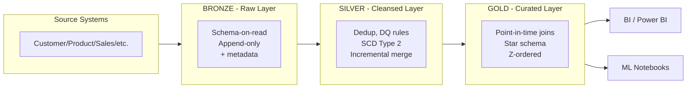

# Enterprise Retail Lakehouse Platform

[]() []() []() []() []()

> A production-pattern Medallion Architecture lakehouse — built end-to-end with PySpark, Delta Lake, and Airflow — solving a real enterprise retail data integration problem across 10 business domains, entirely on free tooling.

**In one sentence:** This platform replaces a multinational retailer's fragmented, manual-Excel-based reporting with a governed, auditable, incrementally-updated Lakehouse that tracks historical change (SCD Type 2) and prevents ML data leakage through point-in-time-correct joins.

**Why it's worth a look, even in 90 seconds:**
- Config-driven architecture — onboarding a new data domain requires a YAML entry, not new code (verified across ingestion, transformation, *and* orchestration layers)
- SCD Type 2 + point-in-time Gold joins — the single most commonly *claimed but incorrectly implemented* pattern in portfolio projects (see [`docs/architecture.md`](docs/architecture.md) for why "join to current dimension" silently defeats the entire point)
- Honest, named limitations instead of a project claiming to be flawless (see below) — because real platforms have edges, and pretending otherwise doesn't survive a technical interview

This project demonstrates the core competencies expected of a 3+ year Data Engineer: config-driven ETL, incremental loading, Slowly Changing Dimension (SCD Type 2) historical tracking, data quality enforcement, structured logging, exception handling, and orchestration — all built on a 100% free technology stack.

---

## Why This Project Exists

A multinational retailer ingests daily data across 10 domains (Customer, Product, Inventory, Suppliers, Sales, Returns, Promotions, Shipping, Stores, Online Orders) from disconnected operational systems, resulting in duplicate reports, poor data quality, and no historical tracking. This platform consolidates that data into a governed, auditable, analytics- and ML-ready Lakehouse.

Full business context: [`docs/architecture.md`](docs/architecture.md) · Project Charter and BRD available on request.

---

## Architecture



See [`docs/architecture.md`](docs/architecture.md) for the complete set of diagrams (low-level architecture, component diagram, sequence diagram, deployment mapping) and the reasoning behind each architectural decision.

---

## Tech Stack

| Layer | Technology |
|---|---|
| Processing | PySpark, Spark SQL |
| Storage | Delta Lake (ACID, MERGE, time travel) |
| Orchestration | Apache Airflow |
| Compute (dev/demo) | Databricks Community Edition |
| Data Quality | Custom config-driven rule engine |
| Testing | pytest, pytest-cov |
| CI | GitHub Actions |
| Language | Python 3.11, PEP-8, type-hinted |

100% free tools — no paid cloud services required. See [`docs/deployment_guide.md`](docs/deployment_guide.md) for how this maps to a production cloud deployment.

---

## Project Structure

```
enterprise-retail-lakehouse/
├── config/              # Layered YAML configuration (base + env + per-table)
├── data/                # Landing zone + Bronze/Silver/Gold Delta tables (generated, gitignored)
├── src/
│   ├── common/          # Shared framework: logger, config, data quality, exceptions, spark, delta utils
│   ├── ingestion/        # Bronze layer
│   ├── transformation/   # Silver layer (facts + SCD2 dimensions)
│   └── aggregation/       # Gold layer (star schema, point-in-time joins)
├── dags/                # Airflow orchestration
├── tests/               # Unit, integration, and fixtures
├── docs/                # Full documentation set (this folder)
└── notebooks/           # Exploration only - no production logic
```

Full layout and naming/branching/commit conventions: [`docs/developer_guide.md`](docs/developer_guide.md)

---

## Getting Started

```bash
git clone <repo-url> && cd enterprise-retail-lakehouse
python3 -m venv .venv && source .venv/bin/activate
pip install -r requirements.txt
python scripts/validate_env.py          # confirms Java/Spark/Delta are correctly wired
```

Full environment setup (Java, Spark, Databricks Community Edition, Airflow, Docker): [`docs/developer_guide.md`](docs/developer_guide.md)

**Run the full pipeline locally:**
```bash
python -m src.pipelines.run_bronze_pipeline
python -m src.pipelines.run_silver_pipeline
python -m src.pipelines.run_gold_pipeline
```

**Or via Airflow:**
```bash
export AIRFLOW_HOME=$(pwd)/airflow_home
cp dags/retail_lakehouse_dag.py $AIRFLOW_HOME/dags/
airflow dags test retail_lakehouse_pipeline $(date +%F)
```

---

## Data Model

Star schema with SCD Type 2 dimensions (`dim_customer`, `dim_product`) for point-in-time-correct historical reporting, and SCD Type 1 dimensions (`dim_store`, `dim_supplier`) where historical accuracy isn't business-critical. Full entity list, keys, grain, and partitioning rationale: [`docs/data_dictionary.md`](docs/data_dictionary.md)

---

## Key Design Decisions (the "why," not just the "what")

| Decision | Why |
|---|---|
| Medallion architecture (3 layers) | Preserves raw replayable truth (Bronze) separately from business-conformed data (Gold) |
| Config-driven pipelines | Adding a new data domain requires a config change, not new code — proven across ingestion, transformation, *and* orchestration layers |
| SCD Type 2 + point-in-time Gold joins | Prevents data leakage in ML training data and ensures historically accurate BI reporting |
| Quarantine over hard-fail | One bad row shouldn't block 50,000 good ones — the pipeline degrades gracefully, not catastrophically |
| Custom lightweight DQ engine over Great Expectations | Full transparency into rule mechanics for this project's scale; noted where GX would be the better choice at larger scale |

Full rationale for every architectural decision: [`docs/architecture.md`](docs/architecture.md)

---

## Testing

```bash
pytest tests/unit/ tests/integration/ -v --cov=src --cov-report=term-missing
```

70%+ coverage target, deliberately focused on high-value logic (SCD2 correctness, point-in-time joins, quarantine behavior) rather than 100% coverage for its own sake. Full testing philosophy, edge case checklist, and known gaps: [`docs/testing_strategy.md`](docs/testing_strategy.md) *(see also inline docstrings — every test file explains what it proves and why)*

---

## Known Limitations (named deliberately, not hidden)

- Referential integrity between Gold-layer facts and dimensions isn't explicitly validated (unmatched join keys currently resolve to `NULL` silently) — see `docs/testing_strategy.md` Section 4.
- Streaming ingestion is out of scope but the Bronze/Silver contracts are designed to support a future migration without redesign (see `docs/architecture.md`).
- Concurrent-write retry behavior (`ConcurrentAppendException`) is handled by Delta's optimistic concurrency control but not explicitly tested.

---

## Documentation Index

| Document | Purpose |
|---|---|
| [`docs/architecture.md`](docs/architecture.md) | Full architecture, diagrams, and decision rationale |
| [`docs/developer_guide.md`](docs/developer_guide.md) | Environment setup, coding standards, git workflow |
| [`docs/deployment_guide.md`](docs/deployment_guide.md) | How this maps to a real cloud production deployment |
| [`docs/data_dictionary.md`](docs/data_dictionary.md) | Every table, column, key, and business definition |
| [`docs/runbook.md`](docs/runbook.md) | Operational procedures: how to run, monitor, and recover the pipeline |
| [`docs/testing_strategy.md`](docs/testing_strategy.md) | Test pyramid, coverage policy, known gaps |
| [`docs/troubleshooting.md`](docs/troubleshooting.md) | Common failure modes and how to resolve them |
| [`docs/business_glossary.md`](docs/business_glossary.md) | Business term definitions for non-engineering stakeholders |

---

## License

MIT — see [LICENSE](LICENSE)
