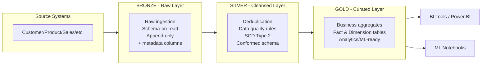
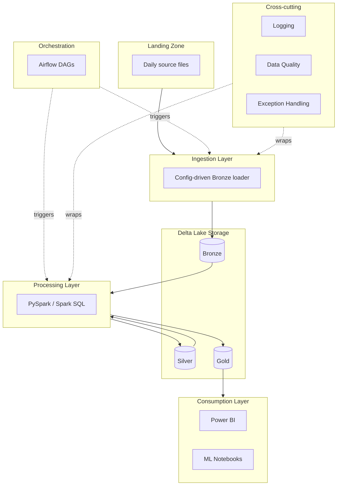
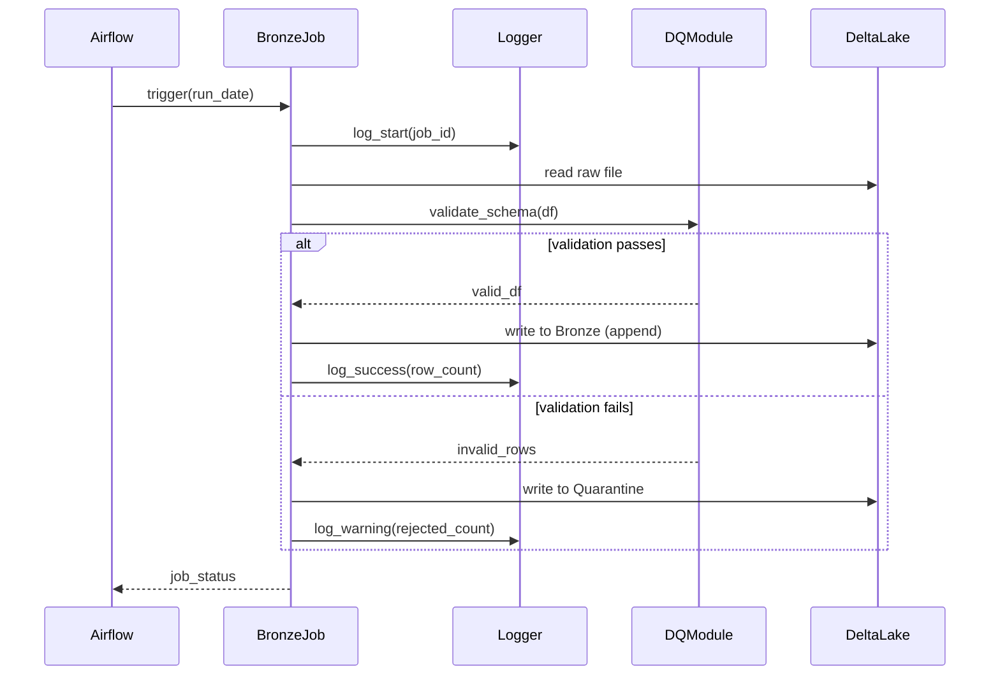

# Architecture Guide

## 1. Business Context

A multinational retailer operating across North America, Europe, and Asia currently stores data in disconnected operational systems across 10 domains (Customer, Product, Inventory, Suppliers, Sales, Returns, Promotions, Shipping, Stores, Online Orders). This causes duplicate reporting, poor data quality, manual Excel reconciliation, and no historical tracking.

This platform consolidates that data into a single governed Lakehouse supporting batch processing, incremental loading, historical tracking, analytics, ML, and a future migration to streaming.

## 2. Medallion Architecture

| Layer | Purpose | Mutability | Schema | Who reads it |
|---|---|---|---|---|
| Bronze | Exact copy of source + audit metadata | Append-only, never updated | Schema-on-read, source-native | Data Engineers only |
| Silver | Validated, deduplicated, conformed, historized | Merged/upserted | Enforced, conformed schema | Data Engineers, Analysts |
| Gold | Business-level aggregates | Rebuilt from Silver | Star schema (facts/dims) | Business users, BI, ML |

**Why three layers:** Two layers (raw + curated) tempts doing validation and business logic in the same step — if a bug corrupts "curated" data, there's no clean raw copy to replay from. Three is the proven separation of concerns: Bronze = fidelity, Silver = correctness, Gold = business meaning.

## 3. High-Level Architecture

Logging, data quality, and exception handling are drawn as cross-cutting rather than embedded per-pipeline — every module imports one shared framework (`src/common/`) rather than reimplementing these concerns independently.

## 4. Sequence: A Single Pipeline Run

Failure is a branch, not a crash — one bad row quarantines itself without blocking the rest of the batch.

## 5. Key Architectural Decisions

| Decision | Rationale |
|---|---|
| Medallion (3-layer) over single-layer warehouse load | Preserves raw truth for replay; separates fidelity, correctness, and business meaning |
| Delta Lake over plain Parquet | ACID transactions, time travel, native `MERGE` support for incremental loads and SCD2 |
| Config-driven pipelines (table config drives paths, schema, keys, DQ rules, SCD type) | Onboarding a new domain requires a config entry, not new code — proven at the ingestion, transformation, *and* orchestration layers |
| Quarantine pattern over hard-fail-on-bad-row | A few bad rows shouldn't block an entire batch of otherwise-good data |
| Point-in-time joins in Gold (not join-to-current-dimension) | Prevents data leakage in ML training sets and produces historically accurate BI reporting — the entire reason SCD2 was built |
| SCD Type 2 for Customer/Product, Type 1 for Store/Supplier | Customer/product attributes materially affect historical analysis; store/supplier metadata changes rarely and historical accuracy there isn't business-critical |
| Custom lightweight Data Quality engine over Great Expectations | Full transparency for this project's scale and a single-engineer context; GX becomes worthwhile at multi-team scale needing shared rule governance |
| Airflow DAG tasks generated dynamically from config, not hardcoded | The orchestration layer never needs to change when a new domain is added — same config-driven principle applied end-to-end |

## 6. Future Streaming Compatibility

Bronze tables already carry `_ingest_ts` metadata; Silver's `MERGE`-based upserts are already idempotent and batch-size-agnostic. Migrating to Structured Streaming later requires swapping `spark.read` for `spark.readStream` at the ingestion entry point and adding a checkpoint location — no downstream redesign.

## 7. Deployment Mapping (Free Tier → Production Cloud)

See [`deployment_guide.md`](deployment_guide.md) for the full mapping from Databricks Community Edition / local dev to a production AWS/Azure deployment.
