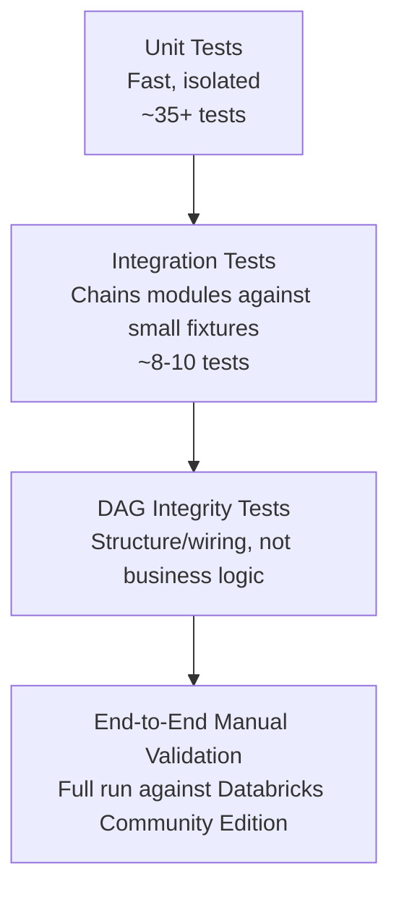

# Testing Strategy

## 1. Test Pyramid



Most confidence comes from unit tests (fast, precise failure localization); E2E runs are slow and only run before major milestones/demos. This shape is deliberate — see rationale in the module-by-module implementation notes.

## 2. Coverage by Module

| Module | Unit Tested | Integration Tested |
|---|---|---|
| `logger.py` | JSON formatting, handler idempotency | via every other module's usage |
| `config_loader.py` | Deep merge, table config resolution | Module 6 framework chain |
| `data_quality.py` | Each rule type, violation capture, pass rate | Module 6, Module 12 |
| `exception_handler.py` | Retry/backoff, exception hierarchy | Bronze loader's transient-read path |
| `delta_utils.py` | `merge_upsert`, `scd2_merge` core logic | Module 6, Module 12 edge cases |
| `bronze_loader.py` | Helper functions (`_tag_metadata`, `_build_schema`) | `test_bronze_to_silver_pipeline.py` |
| `silver_processor.py` | `_deduplicate_on_business_key` | Same as above |
| `scd2_handler.py` | `_deduplicate_within_batch` | Framework integration test (Module 6) |
| `gold_builder.py` | `_point_in_time_join` (the most important test in the project) | Manual E2E verification query |
| `retail_lakehouse_dag.py` | N/A (structure only) | DAG integrity tests |

## 3. Coverage Policy

Target: **70%+**, deliberately not 100%. Coverage is concentrated on high-risk logic (SCD2 correctness, point-in-time joins, quarantine behavior, retry/backoff) rather than trivial code paths. Enforced in CI via `--cov-fail-under=70`.

## 4. Known Gaps (named explicitly, not hidden)

- **Referential integrity** between Gold-layer facts and dimensions is not validated — a `fact_sales` row whose key doesn't resolve to any dimension row produces a silent `NULL` surrogate key rather than a flagged violation. A production-grade addition would count and alert on unmatched join keys post-Gold-build.
- **Concurrent pipeline runs**: Delta's optimistic concurrency control handles simultaneous writes to the same path at the storage layer, but retry behavior on `ConcurrentAppendException` is not explicitly tested.
- **FR-08 (reprocess a specific date)** is proven indirectly via idempotency tests, but lacks a dedicated integration test explicitly simulating "reprocess July 20th after a bug fix" as a named scenario.

## 5. Regression Testing Policy

Every bug fix is accompanied by a test that reproduces the bug (fails pre-fix, passes post-fix) — checked via self-review for this solo project, equivalent to a PR review gate on a team.

## 6. Performance Benchmarking Policy

- Benchmarks (`scripts/benchmark_gold_queries.py`) are **not part of CI** — timing is environment-sensitive and would produce flaky pass/fail signals unrelated to code correctness
- Run manually before major architecture changes and before portfolio demos
- Always includes an unpartitioned control table to isolate the effect of partitioning specifically from "the filtered result set is smaller"
- Results documented with real numbers from the actual run environment

## 7. Mock Data Tiers

| Tier | Used For | Size |
|---|---|---|
| Inline `spark.createDataFrame([...])` | Unit tests | 1–5 rows, hand-verifiable |
| CSV fixtures in `tests/fixtures/sample_data/` | Integration tests | Small, deliberately includes clean + invalid + changed rows |
| Online Retail II + synthetic generator | E2E / demo | Realistic volume and messiness |

## 8. Requirement Traceability (BRD → Test)

| Requirement | Proven By | Status |
|---|---|---|
| FR-01 (Bronze ingestion + metadata) | `test_tag_metadata_adds_all_required_columns` | ✅ |
| FR-02 (schema validation/quarantine) | `test_build_schema_raises_on_unsupported_type` + integration test | ✅ |
| FR-03 (deduplication) | Fact + within-batch dedup tests | ✅ |
| FR-04 (incremental loading) | `merge_upsert` idempotency + cross-batch edge cases | ✅ |
| FR-05 (SCD2) | `scd2_merge` change/no-change/mixed-scenario tests | ✅ |
| FR-07 (logging every run) | Logger tests + manual log inspection | ✅ |
| FR-08 (reprocess a specific date) | Idempotency proven; no dedicated named scenario test | ⚠️ Partial |
| NFR-06 (auditability) | Violation capture + metadata tagging tests | ✅ |

## 9. Running the Suite

```bash
pytest tests/unit/ -v --cov=src --cov-report=term-missing --cov-fail-under=70
pytest tests/integration/ -v
```
